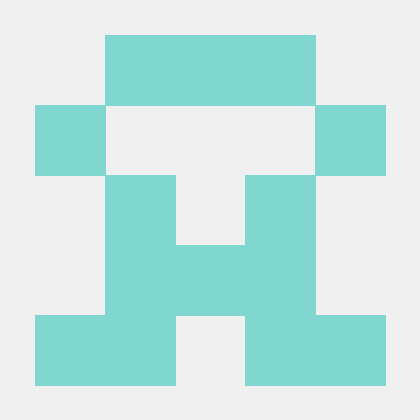

    <h3>[2025] 싸피 1학기 관통 프로젝트</h3>
    <h1>🧸 키즈홈 / KidsHome 🏡</h1> 
    
    

        우리 아이와 함께 살아가는 공간, <strong style="color:#fcb707">키즈홈</strong>
    

    

        <strong>키즈홈</strong>은 초·중·고 자녀를 둔 <strong>학부모를 위한 맞춤형 부동산 매물 플랫폼</strong>입니다. 
        아이와 함께 안전하고 행복하게 살아갈 수 있는 <strong>최적의 주거 환경</strong>을 추천합니다.
    

    

    

        학년이 올라갈수록 자녀 교육에 대한 부담은 커지지만, 우수 학군이나 학원 정보는 흩어져 있어 부모가 직접 조사하기 어렵습니다. 또한, 어린 자녀를 둔 가정은 의료 접근성을 필요로 하나 범용 사용자를 타겟으로 하는 기존 부동산 플랫폼은 이러한 정보만을 중심적으로 제공하진 않습니다.
         
         
        <strong>키즈홈</strong>은 이처럼 <strong>자녀 중심의 생활 정보</strong>를 고려한 학군, 의료, 문화시설 등 다양한 요소를 종합적으로 분석하여 가장 적합한 지역과 매물을 추천하고, 부모의 부담을 덜어주는 것을 목표하고 있습니다. 
    

    ⯎

    <h2>📑 목차</h2>
    > <a href="#introduction">프로젝트 개요</a> 
    > <a href="#roadmap">프로젝트 로드맵</a> 
    > <a href="#developers">팀원 및 역할</a> 
    > <a href="#tech-stack">기술 스택 및 시스템 아키텍쳐</a> 
    <!-- > <a href="#key-features">주요 기능</a>  -->
    > <a href="#deliverables">프로젝트 산출물</a> 
    <!-- > <a href="#retrospective">개발 결과 및 회고</a> 
    > <a href="#demo">스크린샷 및 데모 영상</a>  -->

 

    <h2>📌 프로젝트 개요</h2>
    <ul>
        <li><strong>프로젝트명</strong> : 키즈홈 (KidsHome)</li>
        <li><strong>개발 기간</strong> : 2025.05.07 - 2025.05.27 (총 21일)</li>
        <li><strong>개발 인원</strong> : 총 2인</li>
    </ul>

 

    <h2>🗂️ 프로젝트 로드맵</h2>
    

 

    <h2>🧑 팀원 및 역할</h2>
    

    <table>
        <tr>
            <td width="25%" align="center"> 
                <a href="https://github.com/0w0n2">
                      
                    <strong>이혜원</strong>
                </a>
                 팀장 / Backend, Frontend 
            </td>
            <td width="25%" align="center"> 
                <a href="https://github.com/Kimyoungmin97">
                      
                    <strong>김영민</strong>
                </a>
                 Backend, Frontend 
            </td>
        </tr>
        <tr>
            <td width="160px" valign="top">
                
                - 프로젝트 기획, GitHub 문서 정리 
                - ERD 설계 및 DB 구조 정의 
                - Spring Security + JWT 기반 사용자 인증/인가 기능 
                - 공지사항, 동네 게시판 CRUD 
                - 공지사항 게시판 UI 구현 
                - AI 매물 분석 기능 구현(프롬프팅 설계, OpenAI API 연동, MVC 처리) 
                - 카카오맵 기반 매물 시각화 및 상세 정보 패널 UI 구현
                
            </td>
            <td width="160px" valign="top">
                
                - UI/UX 설계 및 전체 화면 구현 
                - 프로젝트 초기 구조 설계 
                - ERD 설계 및 DB 구조 정의 
                - 사용자 인증/인가 기능 공동 구현 
                - 매물 실거래가 정보 관련 CRUD
                - 동네 게시판 기능 구현
                - 인기 검색어 기능 구현(Redis 활용) 
                
            </td>
        </tr>
    </table>
    

 

<h2>기술 스택 및 시스템 아키텍쳐</h2>
<h3>📌 시스템 아키텍처</h3>

<h3>📦 기술 스택</h3>
<h3>✅ Frontend</h3>

  
  
   
  
  
  
  
  
  

<table style="width:100%; table-layout: fixed;">
  <thead>
    <tr><th style="width:25%;">구분</th><th>사용 기술</th></tr>
  </thead>
  <tbody>
    <tr><td><strong>Language</strong></td><td>JavaScript (ES6)</td></tr>
    <tr><td><strong>Framework</strong></td><td>Vue 3</td></tr>
    <tr><td><strong>Build Tool</strong></td><td>Vite</td></tr>
    <tr><td><strong>Library / API</strong></td><td>Bootstrap, Kakao Map API</td></tr>
    <tr><td><strong>IDE</strong></td><td>Visual Studio Code</td></tr>
  </tbody>
</table>

<h3>✅ Backend</h3>

  
   
  
  
  
  
  
  
  
  
   
  

<table style="width:100%; table-layout: fixed;">
  <thead>
    <tr><th style="width:25%;">구분</th><th>사용 기술</th></tr>
  </thead>
  <tbody>
    <tr><td><strong>Language</strong></td><td>Java 17</td></tr>
    <tr><td><strong>Framework</strong></td><td>Spring Boot</td></tr>
    <tr><td><strong>Library</strong></td><td>Spring Security, MyBatis, JWT, ChatGPT(OpenAI API)</td></tr>
    <tr><td><strong>Database</strong></td><td>MySQL, Redis</td></tr>
    <tr><td><strong>IDE</strong></td><td>Spring Tool Suite (STS)</td></tr>
    <tr><td><strong>Build Tool</strong></td><td>Maven</td></tr>
  </tbody>
</table>

<h3>🧰 Development Tools</h3>

  
  
  
  

 

    <h2>프로젝트 산출물</h2>
    <h3>ERD</h3>
    

    
    

    <h3>Class Diagram</h3>
    

    
    

